# BazardShop

**Marketplace e-commerce** — Projet Web MDS B3 DEW 25-26  
React · API REST · SQLite · Architecture MVVM

---

## Table des matières

1. [Contexte](#1-contexte)
2. [Partie fonctionnelle](#2-partie-fonctionnelle)
3. [Installation et lancement](#3-installation-et-lancement)
4. [Partie technique](#4-partie-technique)
5. [Auteur](#5-auteur)

---

## 1. Contexte

### Nom et principe

**BazardShop** est une application web de type marketplace permettant à des utilisateurs de **consulter un catalogue de produits**, de **vendre leurs propres articles** et d’**échanger entre acheteurs et vendeurs** via une messagerie intégrée.

### But de l’application

L’objectif est de proposer une expérience d’achat et de vente **simple, sécurisée et professionnelle** :

- Découvrir des produits sur une page d’accueil claire et responsive.
- Créer un compte vendeur ou acheteur en quelques clics.
- Gérer ses annonces depuis un tableau de bord dédié.
- Personnaliser son profil (nom, bio, photo).
- Contacter un vendeur directement depuis la fiche produit.

### Public cible

Étudiants, particuliers et petits vendeurs souhaitant publier et vendre des produits en ligne sans passer par une plateforme complexe.

### Stack générale

| Couche        | Technologie                          |
|---------------|--------------------------------------|
| Frontend      | React 19 + Vite + Material UI (MUI)  |
| API           | Node.js + Express 5                  |
| Base de données | SQLite 3                           |
| Authentification | JWT (JSON Web Token)              |

---

## 2. Partie fonctionnelle

Cette section décrit le parcours utilisateur des principales fonctionnalités.

### 2.1 Catalogue et fiche produit

**Parcours :** Accueil → clic sur un produit → fiche détaillée.

- La page d’accueil affiche tous les produits disponibles (titre, prix, image, vendeur).
- Chaque carte renvoie vers une page produit dédiée (`/products/:id`) avec description complète, prix et bouton **« Contacter le vendeur »**.
- Si l’utilisateur n’est pas connecté, il est invité à se connecter avant d’accéder au chat.

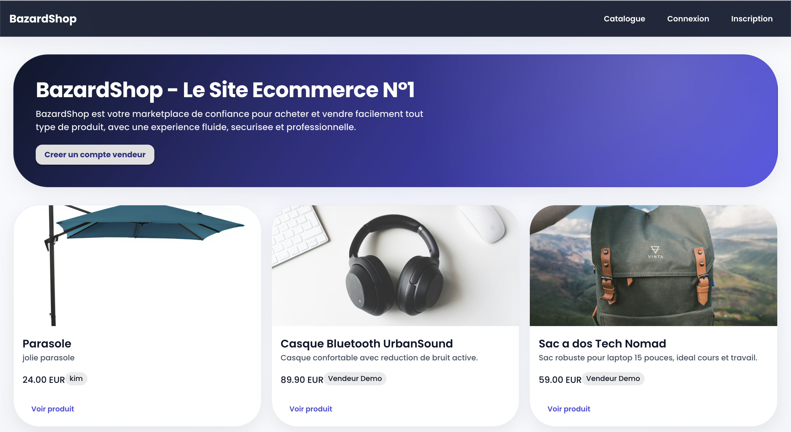

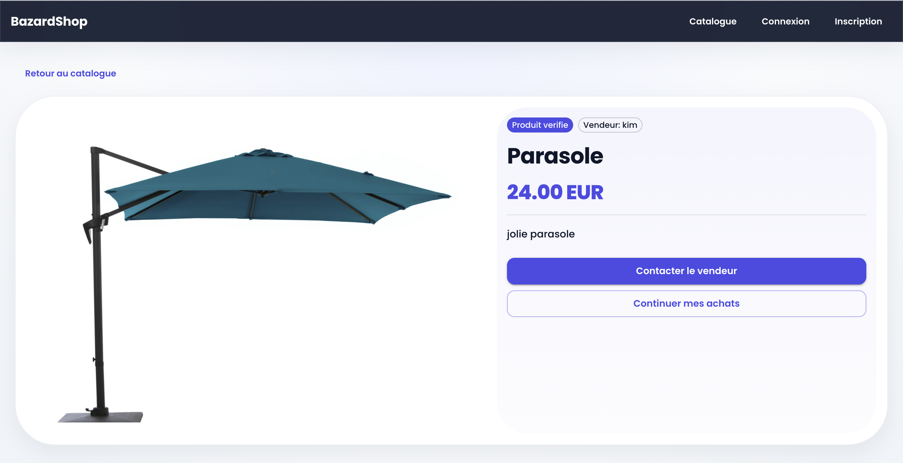

### 2.2 Authentification (inscription / connexion)

**Parcours :** Navbar → Inscription ou Connexion.

- **Inscription** : nom, email, mot de passe (minimum 6 caractères). Un token JWT est généré et stocké côté navigateur.
- **Connexion** : email + mot de passe. Accès aux pages protégées (profil, dashboard, messages).
- Les routes sensibles redirigent automatiquement vers `/login` si l’utilisateur n’est pas authentifié.

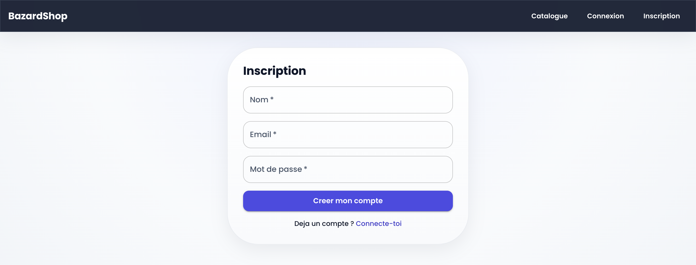

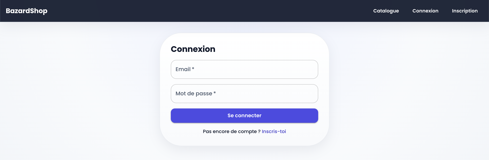

### 2.3 Dashboard vendeur (CRUD produits)

**Parcours :** Connexion → Dashboard.

Le vendeur peut effectuer un **CRUD complet** sur ses produits :

| Action   | Description                                              |
|----------|----------------------------------------------------------|
| **Create** | Ajouter un produit (titre, description, prix, média)   |
| **Read**   | Voir la liste de ses annonces publiées                 |
| **Update** | Modifier un produit existant via une fenêtre modale    |
| **Delete** | Supprimer une annonce                                  |

L’upload de fichiers accepte les formats **image, audio et vidéo** (`image/*`, `audio/*`, `video/*`).

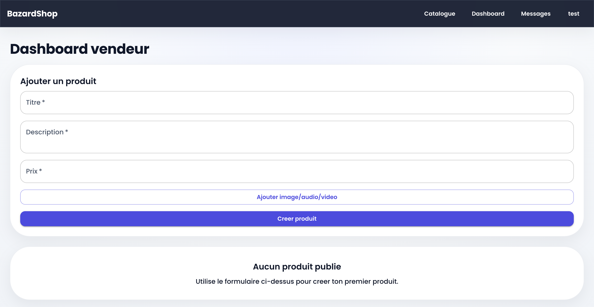

### 2.4 Upload de médias

**Parcours :** Dashboard ou Profil → bouton d’ajout de fichier.

- Les fichiers sont envoyés à l’API (`POST /api/upload`) puis stockés dans `backend/uploads/`.
- L’URL retournée est associée au produit ou à l’avatar du profil.
- Formats supportés côté formulaire produit : images, audio, vidéo.


### 2.5 Profil utilisateur

**Parcours :** Navbar → Profil (`/profile`).

Page complète permettant de :

- Modifier le **nom** et la **bio** (avec compteur de caractères).
- Changer la **photo de profil** (aperçu immédiat avant sauvegarde).
- Consulter des **statistiques** : annonces publiées, conversations, date d’inscription.
- **Se déconnecter** depuis une section dédiée en bas de page.

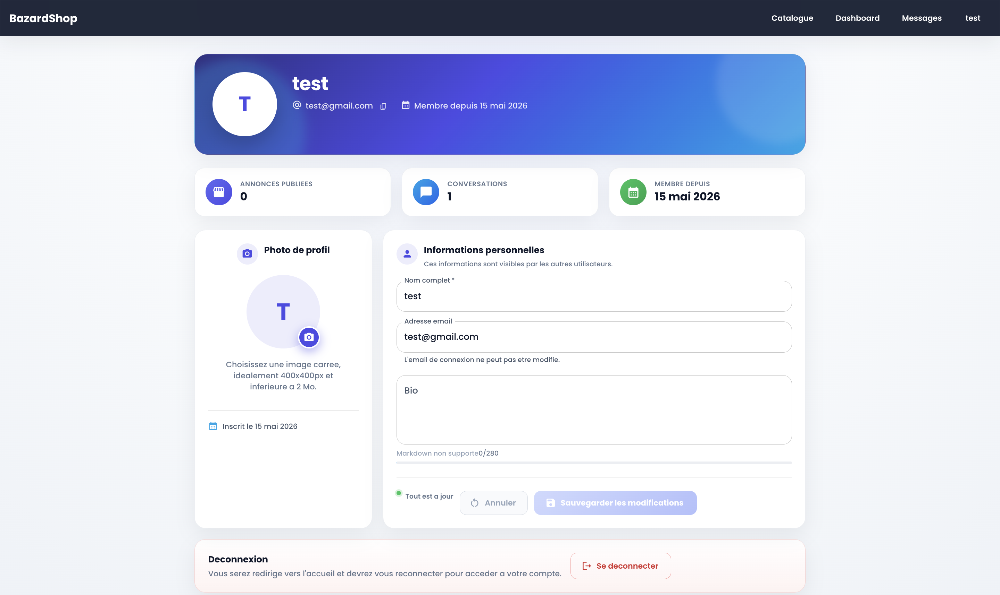

### 2.6 Messagerie (chat)

**Parcours :** Messages → sélection d’une conversation → envoi de message.  
Ou : Fiche produit → **Contacter le vendeur**.

- Liste des conversations avec recherche et démarrage d’une nouvelle discussion.
- Affichage des messages par bulles (envoyés / reçus), séparateurs de date.
- Rafraîchissement automatique des messages (polling toutes les 4 secondes).
- Interface responsive : sidebar sur desktop, navigation plein écran sur mobile.

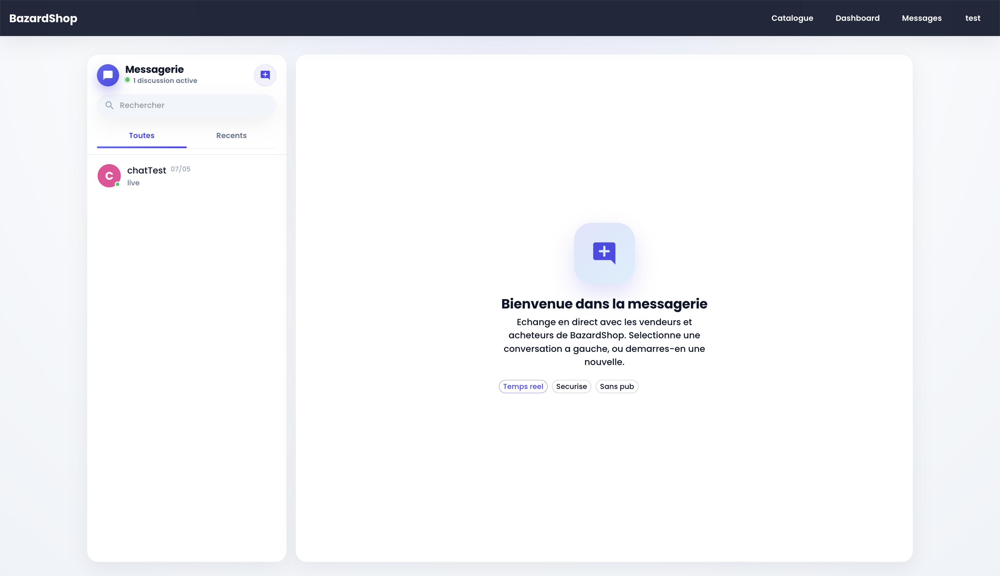

---

## 3. Installation et lancement

### Prérequis

- **Node.js** 18 ou supérieur
- **npm** 9 ou supérieur

### Configuration

**Backend** — copier et adapter `backend/.env` :

```env
PORT=4000
JWT_SECRET=votre_cle_secrete_longue_et_aleatoire
CLIENT_URL=http://localhost:5173
```

**Frontend** — copier et adapter `frontend/.env` :

```env
VITE_API_URL=http://localhost:4000/api
```

### Installation des dépendances

```bash
# À la racine du projet
cd backend && npm install && cd ..

cd frontend && npm install && cd ..
```

### Lancement en développement

Ouvrir **deux terminaux** :

```bash
# Terminal 1 — API
cd backend
npm run dev
```

```bash
# Terminal 2 — Frontend
cd frontend
npm run dev
```

- **Frontend :** http://localhost:5173  
- **API :** http://localhost:4000  
- **Health check :** http://localhost:4000/api/health  

### Compte de démonstration

Un compte vendeur de test est créé automatiquement au premier démarrage :

| Champ      | Valeur                 |
|------------|------------------------|
| Email      | `demo@bazardshop.dev`  |
| Mot de passe | `Demo1234!`          |

### Build production (frontend)

```bash
cd frontend
npm run build
```

Les fichiers statiques sont générés dans `frontend/dist/`.

---

## 4. Partie technique

### 4.1 Technologies utilisées et choix

| Technologie | Version (projet) | Rôle | Pourquoi ce choix |
|-------------|------------------|------|-------------------|
| **React** | 19.2.x | Interface utilisateur | Écosystème mature, composants réutilisables, conforme au sujet |
| **Vite** | 8.0.x | Build & dev server | Démarrage rapide, HMR performant |
| **Material UI** | 9.0.x | Composants UI | Bibliothèque gratuite, design professionnel, responsive |
| **React Router** | 7.14.x | Routing SPA | Navigation fluide sans rechargement |
| **Axios** | 1.15.x | Client HTTP | Appels API centralisés avec intercepteurs |
| **Express** | 5.x | API REST | Léger, middleware, routage clair |
| **SQLite** | 5.x / 6.x | SGBD | Fichier unique, simple à déployer en local |
| **jsonwebtoken** | 9.x | Auth JWT | Stateless, adapté aux SPA |
| **bcryptjs** | 3.x | Hash mots de passe | Sécurité des credentials |
| **Multer** | 2.x | Upload fichiers | Gestion multipart/form-data |

### 4.2 Architecture MVVM

Le frontend suit le modèle **MVVM** (Model – View – ViewModel) :

```
┌─────────────┐     ┌──────────────────┐     ┌─────────────┐     ┌─────────────┐
│    View     │ ──► │    ViewModel     │ ──► │   Service   │ ──► │     API     │
│  (React)    │ ◄── │  (hooks custom)  │ ◄── │   (axios)   │ ◄── │  (Express)  │
└─────────────┘     └──────────────────┘     └─────────────┘     └─────────────┘
                            │
                            ▼
                    ┌─────────────┐
                    │    Model    │
                    │  (classes)  │
                    └─────────────┘
```

| Couche | Dossier | Responsabilité |
|--------|---------|----------------|
| **View** | `frontend/src/views/` | Affichage, formulaires, navigation |
| **ViewModel** | `frontend/src/viewmodels/` | Logique métier, état, appels services |
| **Model** | `frontend/src/models/` | Structure des données (Product, Message…) |
| **Service** | `frontend/src/services/` | Communication HTTP avec l’API |
| **Context** | `frontend/src/context/` | État global auth (`AuthContext`) |

### 4.3 Arborescence du projet

```
ecommerce-projet-web/
├── README.md
├── docs/
│   └── screenshots/          # Captures d'écran (à ajouter)
├── backend/
│   ├── .env.example
│   ├── package.json
│   ├── data/                 # Base SQLite (générée au runtime)
│   ├── uploads/              # Fichiers uploadés
│   └── src/
│       ├── server.js         # Point d'entrée Express
│       ├── db.js             # Schéma + seed SQLite
│       ├── middleware/
│       │   └── auth.js       # Vérification JWT
│       └── routes/
│           ├── authRoutes.js
│           ├── productRoutes.js
│           ├── uploadRoutes.js
│           └── chatRoutes.js
└── frontend/
    ├── .env.example
    ├── package.json
    ├── vite.config.js
    └── src/
        ├── main.jsx
        ├── App.jsx
        ├── theme.js
        ├── components/
        ├── context/
        │   └── AuthContext.jsx
        ├── models/
        ├── services/
        ├── viewmodels/
        └── views/
```

### 4.4 Schéma de la base de données

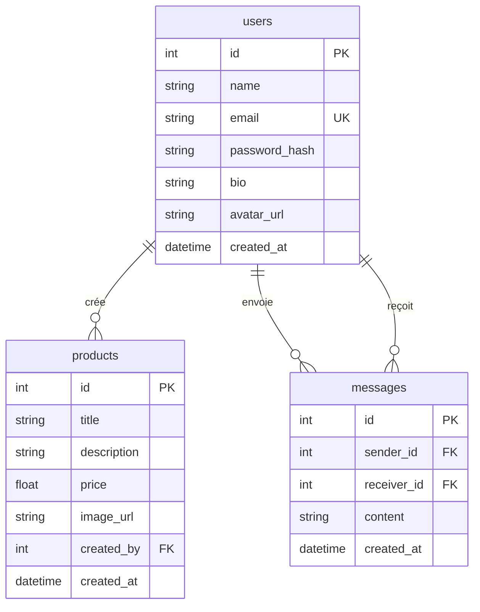

### 4.5 Flux de données

#### Authentification (JWT)

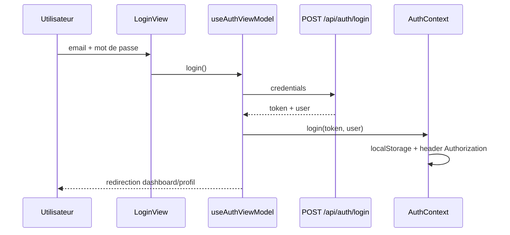

#### CRUD produit

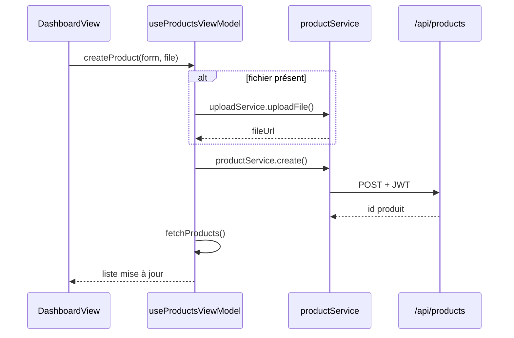

#### Messagerie

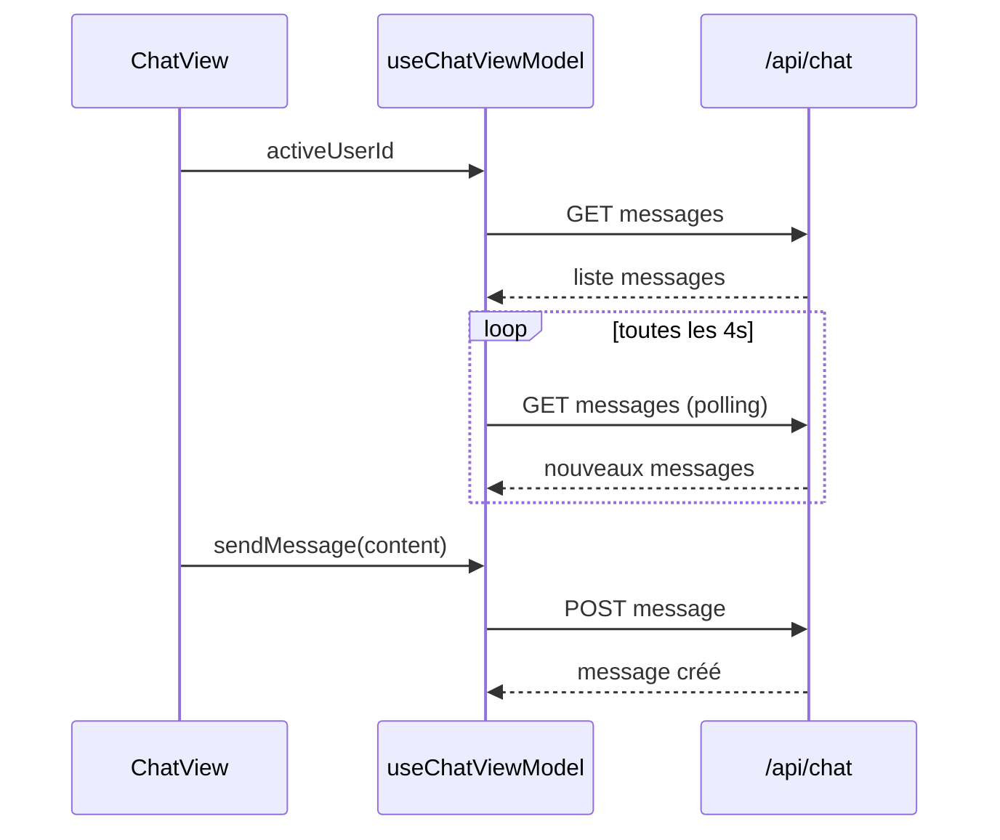

### 4.6 Endpoints API principaux

| Méthode | Route | Auth | Description |
|---------|-------|------|-------------|
| `POST` | `/api/auth/register` | Non | Inscription |
| `POST` | `/api/auth/login` | Non | Connexion |
| `GET` | `/api/auth/me` | Oui | Profil courant |
| `PUT` | `/api/auth/me` | Oui | Mise à jour profil |
| `GET` | `/api/products` | Non | Liste produits |
| `GET` | `/api/products/:id` | Non | Détail produit |
| `POST` | `/api/products` | Oui | Créer produit |
| `PUT` | `/api/products/:id` | Oui | Modifier produit |
| `DELETE` | `/api/products/:id` | Oui | Supprimer produit |
| `POST` | `/api/upload` | Oui | Upload média |
| `GET` | `/api/chat/conversations` | Oui | Liste conversations |
| `GET` | `/api/chat/conversations/:id/messages` | Oui | Messages d’une conversation |
| `POST` | `/api/chat/conversations/:id/messages` | Oui | Envoyer un message |

### 4.7 Routes frontend

| Route | Accès | Page |
|-------|-------|------|
| `/` | Public | Catalogue |
| `/products/:productId` | Public | Fiche produit |
| `/login` | Public | Connexion |
| `/register` | Public | Inscription |
| `/profile` | Protégé | Profil utilisateur |
| `/dashboard` | Protégé | Dashboard vendeur |
| `/chat` | Protégé | Messagerie |

---

## 5. Auteur

- **Dépôt GitHub :** [harribaudk/BazardShop](https://github.com/harribaudk/BazardShop.git)
